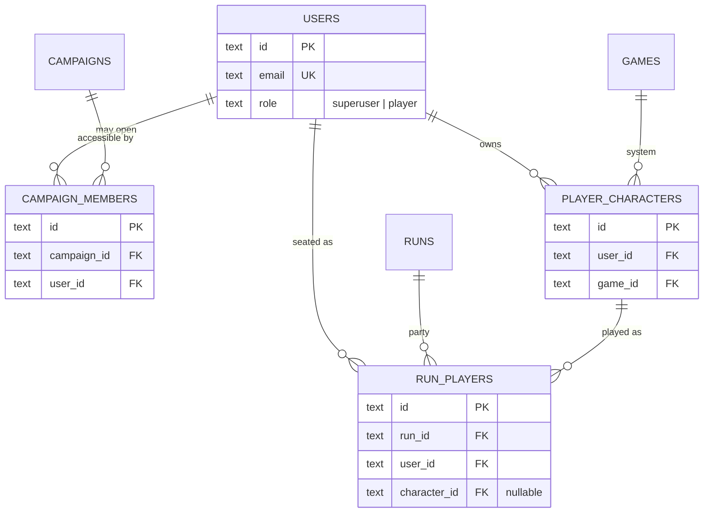
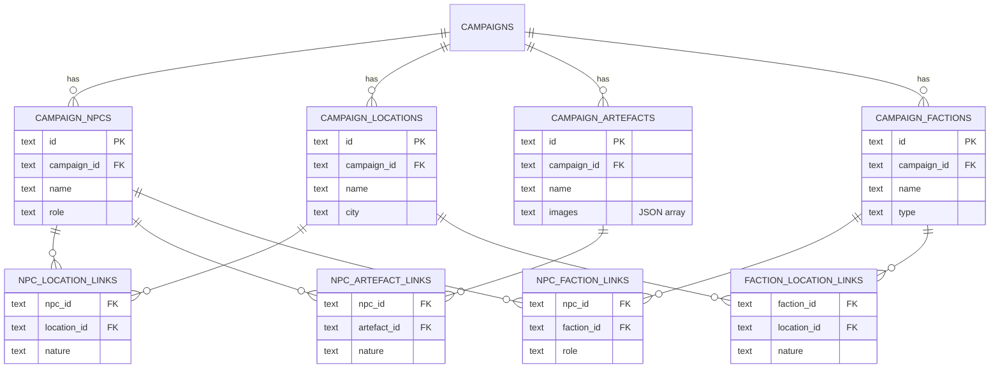
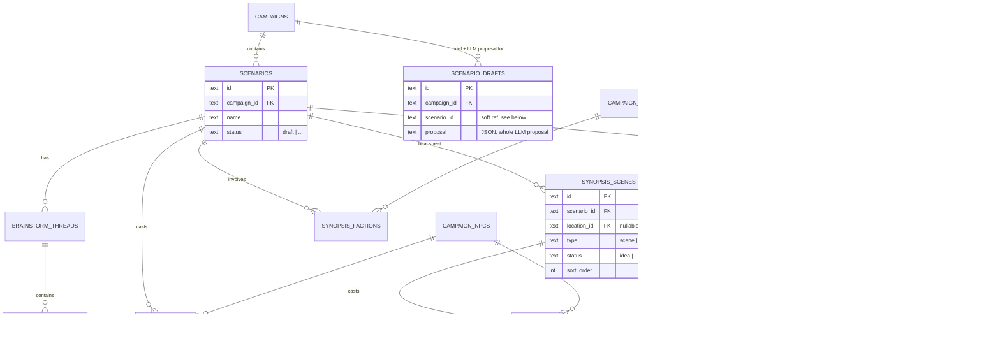
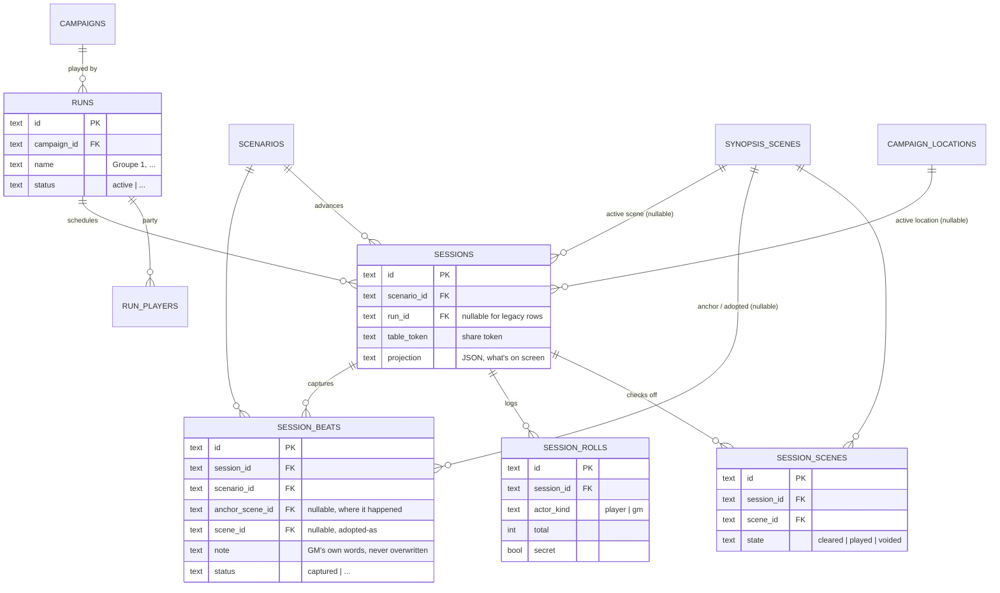

# Data model

The tables in `backend/internal/db/schema.sql`, grouped by what they're for,
with the foreign keys between them. This is a map for navigating the schema,
not a replacement for it — column defaults, `ON DELETE` behaviour and the
comments explaining why a constraint is or isn't there only live in
`schema.sql` itself.

The grouping follows the split described in
[docs/runs.md](runs.md) and
[docs/adr/0001-runs-separate-story-from-play.md](adr/0001-runs-separate-story-from-play.md):
**story** (written once, `campaigns` → `scenarios` → `synopsis_scenes` and the
entities they reference) is authored material; **play** (`runs` → `sessions` →
`session_scenes`) is what one group actually did with it. No column on the
story side ever records progress — see § 4 below.

---

## 1. Overview

```mermaid
erDiagram
    USERS ||--o{ CAMPAIGN_MEMBERS : "has access via"
    USERS ||--o{ PLAYER_CHARACTERS : creates
    USERS ||--o{ RUN_PLAYERS : "plays as"
    GAMES ||--o{ PLAYER_CHARACTERS : "system for"
    GAMES ||--o{ CAMPAIGNS : "optional system for"

    CAMPAIGNS ||--o{ CAMPAIGN_MEMBERS : "grants access to"
    CAMPAIGNS ||--o{ SCENARIOS : contains
    CAMPAIGNS ||--o{ RUNS : "is played by"
    CAMPAIGNS ||--o{ CAMPAIGN_NPCS : owns
    CAMPAIGNS ||--o{ CAMPAIGN_LOCATIONS : owns
    CAMPAIGNS ||--o{ CAMPAIGN_ARTEFACTS : owns
    CAMPAIGNS ||--o{ CAMPAIGN_FACTIONS : owns
    CAMPAIGNS ||--o{ SCENARIO_DRAFTS : owns

    SCENARIOS ||--|| SYNOPSES : has
    SCENARIOS ||--o{ SYNOPSIS_SCENES : contains
    SCENARIOS ||--o{ SYNOPSIS_NPCS : casts
    SCENARIOS ||--o{ SYNOPSIS_FACTIONS : involves
    SCENARIOS ||--o{ SESSIONS : "is played across"
    SCENARIOS ||--o{ BRAINSTORM_THREADS : has
    SCENARIOS ||--o{ SESSION_BEATS : "anchors improv to"

    SYNOPSES ||--o{ SYNOPSIS_SNAPSHOTS : versions

    RUNS ||--o{ RUN_PLAYERS : parties
    RUNS ||--o{ SESSIONS : schedules

    SESSIONS ||--o{ SESSION_SCENES : "checks off"
    SESSIONS ||--o{ SESSION_ROLLS : logs
    SESSIONS ||--o{ SESSION_BEATS : captures

    SYNOPSIS_SCENES ||--o{ SESSION_SCENES : "played via"
    SYNOPSIS_SCENES ||--o{ SCENE_NPCS : casts
    SYNOPSIS_SCENES ||--o{ SCENE_ARTEFACTS : features
    CAMPAIGN_LOCATIONS ||--o{ SYNOPSIS_SCENES : "set at"

    CAMPAIGN_NPCS ||--o{ SCENE_NPCS : appears
    CAMPAIGN_NPCS ||--o{ SYNOPSIS_NPCS : "cast in"
    CAMPAIGN_NPCS ||--o{ NPC_LOCATION_LINKS : "tied to"
    CAMPAIGN_LOCATIONS ||--o{ NPC_LOCATION_LINKS : "tied to"
    CAMPAIGN_NPCS ||--o{ NPC_ARTEFACT_LINKS : "tied to"
    CAMPAIGN_ARTEFACTS ||--o{ NPC_ARTEFACT_LINKS : "tied to"
    CAMPAIGN_NPCS ||--o{ NPC_FACTION_LINKS : "member of"
    CAMPAIGN_FACTIONS ||--o{ NPC_FACTION_LINKS : "member of"
    CAMPAIGN_FACTIONS ||--o{ FACTION_LOCATION_LINKS : "based at"
    CAMPAIGN_LOCATIONS ||--o{ FACTION_LOCATION_LINKS : "based at"
    CAMPAIGN_FACTIONS ||--o{ SYNOPSIS_FACTIONS : "involved in"
    CAMPAIGN_ARTEFACTS ||--o{ SCENE_ARTEFACTS : "features in"

    PLAYER_CHARACTERS ||--o{ RUN_PLAYERS : "played by"
    BRAINSTORM_THREADS ||--o{ BRAINSTORM_MESSAGES : contains
```



This is every foreign key in the schema; `settings` (a flat key/value table,
no relations) is left off. The subsections below pull out one area at a time
with the fields that matter, since the full picture is too dense to read
field-by-field.

---

## 2. Identity & access



Two independent lists answer two different questions — see
[docs/runs.md § "Two player lists, two questions"](runs.md):

- **`campaign_members`** — *may this account open the campaign?* (UI: **Accès**)
- **`run_players`** — *who is at this table, playing whom?* (UI: **Groupes**)

`run_players.character_id` is nullable and `ON DELETE SET NULL`: a seat can
exist before a character is picked, and deleting a character empties the seat
rather than removing the player from the party.

---

## 3. Campaign content (the world)



The four entity types (NPC, location, artefact, faction) belong to a
**campaign**, not a scenario — the same NPC can recur across every scenario in
the campaign. The `*_links` tables are plain many-to-many join tables
(`nature`/`role` is free-text describing the relationship, e.g. "informant",
"lieutenant", "hideout"). All four entity list items in the frontend follow
the shared list-item pattern documented in `CLAUDE.md` (clickable name,
`EntityAvatar`, two lines of metadata).

---

## 4. Story authoring (scenarios & synopsis)



- A **scenario** belongs to one campaign and holds exactly one **synopsis**
  (`synopses.scenario_id` is `UNIQUE`) — the synopsis is the editable
  hook/NPCs/steps document; `synopsis_snapshots` stores point-in-time copies
  of it (diffing, undo).
- **`synopsis_scenes`** is the actual beat sheet — ordered scenes, each
  optionally set at a campaign location, each able to cast NPCs
  (`scene_npcs`) and feature artefacts (`scene_artefacts`).
- **`synopsis_npcs`** / **`synopsis_factions`** record which of the
  campaign's NPCs/factions are in play for a given scenario, distinct from
  which scenes they actually appear in (`scene_npcs`).
- **`scenario_drafts`** (see [docs/scenario-factory.md](scenario-factory.md))
  holds a GM's brief and the LLM's full proposal as one JSON blob until
  committed into real `scenarios`/`synopsis_scenes` rows — `scenario_id` is a
  soft reference (empty until commit), not a foreign key, by design.
- **`brainstorm_threads`**/`brainstorm_messages` are free-form LLM chat
  scoped to a scenario, unrelated to the structured synopsis.

None of these tables ever record whether a group has played them — see § 5.

---

## 5. Play (runs & sessions)



- A **run** (UI: **Groupe**) hangs off the **campaign**, not the scenario —
  progress carries across every scenario the group plays. Its party is
  `run_players` (§ 2).
- A **session** belongs to one run and one scenario: one evening, advancing
  one story. `session_scenes` is the only record of progress — whether a
  scene is `cleared`/`played`/`voided` is a fact about a session, joined
  against a run when the UI needs "has this group played this scene":

  ```sql
  SELECT ss.scene_id, ss.state
  FROM session_scenes ss JOIN sessions s ON s.id = ss.session_id
  WHERE s.run_id = ? AND s.scenario_id = ?
  ```

- **`session_beats`** ([docs/play-improv.md](play-improv.md)) captures
  something the players did that the scenario never anticipated. `scene_id`
  is set once the beat is adopted into the real beat sheet as a
  `synopsis_scenes` row — at that point it's authored material like any
  other scene, and starts out unplayed for every run, including the one that
  improvised it.

**Do not add a column to `synopsis_scenes`, `scenarios`, or `campaigns` that
records what a group did, and do not add a `run_scenes` table.** That's the
mistake this whole split exists to undo — see
[docs/adr/0001-runs-separate-story-from-play.md](adr/0001-runs-separate-story-from-play.md).
Play state lives under `runs`/`sessions` only.
